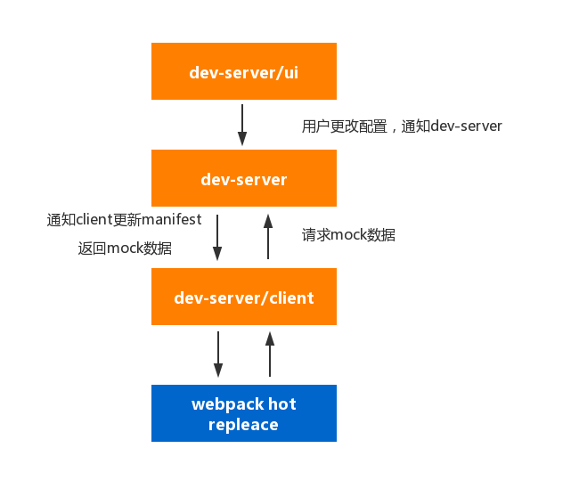

# dev-server

开发时的接口模拟服务器

## 目的

- 解决**离线时**的开发mock问题（离线开发）
- 解决**jsonp**、跨域接口模拟、**全局变量模拟**等问题（mock类型）
- 减少mock数据对源代码的侵入性 (自动解耦)
- 提供UI配置界面进行接口配置 (傻瓜式配置)

等等

## 现状

### webpack-dev-server或webpack-dev-middleware

通过中间件的方式接入至dev-server启动的express服务，可以扩展其路由来进行接口模拟

缺点：

- 无法拦截JSONP请求
- 无法拦截跨域请求
- 无法进行全局变量mock

### rap2等系统

通过启动另一个服务，提供接口模拟方案

缺点：

- 无法拦截JSONP请求
- 无法拦截跨域请求
- 无法进行全局变量mock

### webpack-dev-middleware + http代理 + 第三方mock系统

webpack-dev-middleware通过http代理到第三方mock系统，通过重写请求和转发请求和转发响应，完成数据mock

缺点：

- 无法拦截JSONP请求
- 无法拦截跨域请求
- 无法进行全局变量mock

## 设计思路

期望运行结果：

- npm包安装，本地启动服务
- 可部署在独立的服务器上，单独提供服务

组件解释：

- **dev-server/ui** 主要提供可视化界面，配置相关接口
- **dev-server** 提供mock服务的中间件
- **dev-server/client** dev-server runtime文件，与正常代码一起打包，将mock接口相关的manifest打包至运行时，当有更新的时候通知client，享受原生社区级别的热重载功能

### FAQ

#### 为什么不直接把mock数据和运行时文件一起打包，就像mockjs一样？

因为这无法利用chrome devtools等模拟网络环境

## 可能涉及的相关技术

- 服务器端知识
- Websocket
